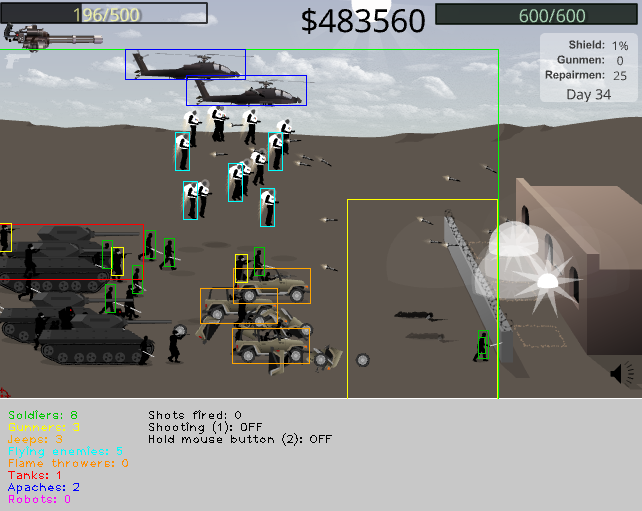

# Storm the House 3 OpenCV 2 Python bot

This project targets Storm the House 3, a classic 2D side-scrolling action game where waves of ground units, vehicles, and airborne enemies approach the player’s base. Enemies vary in size, movement, and threat level, requiring fast target acquisition and continuous tracking to defend the base effectively.

The bot captures the game window, detects the enemy types using a combination of grayscale thresholding, morphology, and template matching, prioritizes targets by type and position, and controls mouse input to track and engage enemies continuously. Optimized with region-of-interest processing.

This project is a personal hobby project created for educational and experimental purposes only. It was developed to explore computer vision techniques, real-time image processing, and basic input automation in a controlled environment. The project is not intended to be used competitively, commercially, or to gain unfair advantages in online or multiplayer games. Use of this code is at your own discretion and responsibility.

Playing the game with the bot turns it more into a strategy game, where success depends on buying the right items at the right time. My main goal was to finish the game without purchasing shooters or gun towers, but I did not manage to achieve this. I believe the weapons in the game are not strong enough to make this possible. The bot is not perfect and can be optimized, but I cannot get past day 15 (out of 40) even with the `Old Glory` gun with maximum upgrades.

I managed to finish the game with the help of gunners and shooting towers. I have also included the full templates in the repository, so you can try to optimize the templates and the detection mechanism yourself. Let me know about your improvements and your high score using this bot.

## Getting Started

### Prerequisites

* The application is tested in [Python 3.13.5](https://www.python.org/downloads/).
* There are some additional libraries. Run `pip3 install -r requirements.txt` command to install the required packages.
* Tested in the Google Chrome browser.

### Setting up game window location

The bot has been tested on a PC with three monitors. To set up the game window location, configure the following variables in `bot.py`:

* `MONITOR`
* `GAME_WINDOW_X`
* `GAME_WINDOW_Y`

### How to play

Press `1` to start shooting. Once shooting has started, stopping it can be difficult because the game window may no longer have focus. Shooting stops automatically when a day has passed or when the pause menu is activated (`p` in-game).

For certain weapons, the left mouse button must be held down continuously. This can be achieved by pressing `2`.

For some weapons, accuracy is the limiting factor, and the shooting delay (`SHOOTING_DELAY_S`) must be increased accordingly.

## How it works

1. <b>Screen capture & ROI</b> 
The game window is captured in real time. All processing is limited to a defined region of interest to maximize performance.

2. <b>Enemy detection</b>
    * First the enemies are detected using template matching with optimized, minimal templates.
    * A secondary color-based detection method for soldiers (black enemies) using grayscale thresholding and morphological operations. This check is only applied within the critical enemy region, where large groups of overlapping soldiers cannot be reliably detected using template matching alone.

3. <b>Post-processing & classification</b> 
Detected objects are classified into enemy types, and assigned visual markers for debugging.

4. <b>Target prioritization</b> 
Enemies are first sorted by threat level (e.g. flying units, vehicles) and then by their distance to the base. A target pool is created from the highest-priority enemies, and a target is selected at random. Using a target pool reduces the number of false-positive shots fired, as some enemies take a short time to disappear.

5. <b>Continuous targeting</b> 
The cursor locks onto a randomly selected target from the target pool and fires, shooting once per captured frame.

## Play tactics

Simply play the game using the bot and experiment with different purchasing strategies and shooting timings. When using the `Desert Eagle`, the optimal value for `SHOOTING_DELAY_S` is approximately 0.2 seconds.

The best weapon to purchase is the `S.C.A.R.`. After applying several accuracy upgrades, `SHOOTING_DELAY_S` can be set to 0. After the `S.C.A.R.`, the `Old Glory` is the next best choice for use with the bot. With `Old Glory`, remember to enable `hold LMB`.

## Authors

* **Luke de Munk** - *Head author*